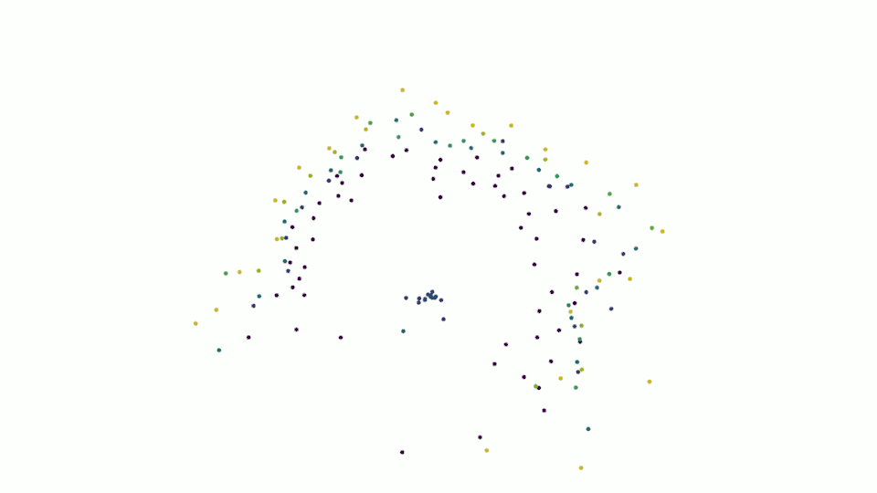
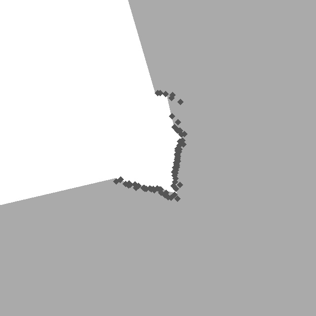

# Arduino 3D Lidar

## Introduction
This repository includes the .stl files, a list of the necessary electronic components, wiring instructions, and the software needed to create your own cheap home-made three-dimensional rotating lidar sensor that provides a full 360° view of the environment at a frequency of 2 Hz detected.

While the title of this project says that this is an Arduino project, you can find a code version for an ESP32 as well. 
There are small but important differences between the two microcontrollers.

Please note: This project uses 8x vl53l0x Lidar range finders, which have a reliable range of up to 3 metres. If you require long range sensors and are not interested in three dimensional point cloud I recommend this repository instead: https://github.com/iliasam/OpenTOFLidar    

## Data Sample
You can find the log sequence shown above [here](https://github.com/FrederikHasecke/arduino-3d-lidar/tree/main/data/sequences/01/lidar_points) if you want to check the quality of the resulting point cloud before starting this project. To visualize the points in python [use this script](https://github.com/FrederikHasecke/arduino-3d-lidar/tree/main/python-receiver-code/offline_visualization.py). 

## Sensor Code
The C code for the microcontroller is available for an [Arduino UNO](https://github.com/FrederikHasecke/arduino-3d-lidar/tree/main/arduino-code) and for an [ESP32](https://github.com/FrederikHasecke/arduino-3d-lidar/tree/main/esp32-code). I have not tested other microcontrollers, but with slight adjustments it should work as well.

## Python Interface

I enjoy working with python due to it's simplicity. If you do as well, you can use [my prepared python scripts](https://github.com/FrederikHasecke/arduino-3d-lidar/tree/main/python-receiver-code) in order to record and/or visualize the sensor output.  

### Requirements
- Python 3
- numpy
- scipy
- [Open3D](https://github.com/isl-org/Open3D) (optional for visualization)

## ROS Interface

This is still on my todo list. If you want to add the communication between the Arduino/ESP32 and a Master feel free to add a PR. 

## 3D Printing Part List
You can find the STL files for 3d printing [here](https://github.com/FrederikHasecke/arduino-3d-lidar/tree/main/stl-files) and an instruction for the assembly [here](https://github.com/FrederikHasecke/arduino-3d-lidar/tree/main/assembly-instructions) 

## Component List
In total you need the following parts to build this 8 channel Lidar sensor.

Part                  | Amount | Cost per item | Amazon Link
----------------------|--------|---------------|------------
vl53l0x               |8       |               |https://www.amazon.de/-/en/AZDelivery-VL53L0X-Flight-Ranging-Sensor/dp/B086TSNTFD/ref=sr_1_3