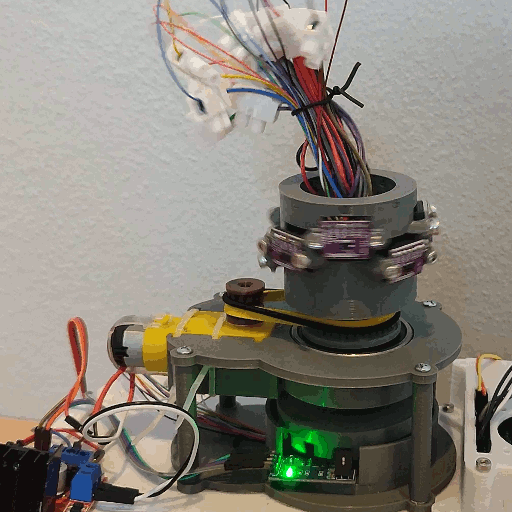
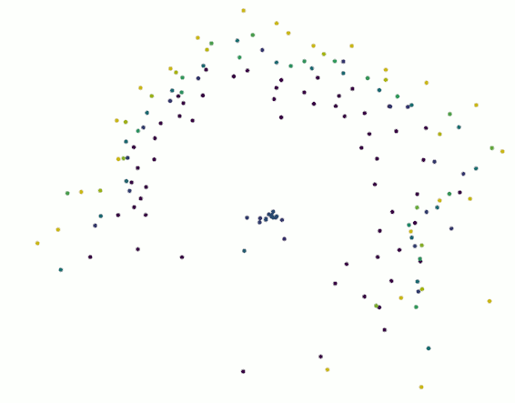
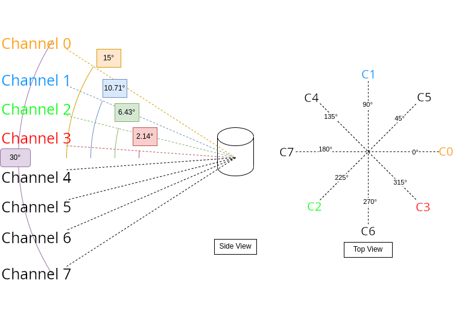

# Arduino 3D LiDAR

>**_DISCLAIMER: This Project is work in progress._** 

>While the sensor is operational in its current form, updates will be provided, including new 3D printing files.

## Introduction
This repository houses all the necessary resources to build your very own budget-friendly 3D rotating LiDAR sensor. Equipped with this sensor, you can capture a comprehensive 360° environmental view at a scan rate of 2 Hz. 

Included herein are .stl files, a detailed list of required electronic components, precise wiring instructions, and essential software. 

Though primarily an Arduino project, you'll also find a version of the code adapted for ESP32. Keep in mind, small but crucial differences exist between these two microcontrollers.

**Note:** This project utilizes 8x vl53l0x LiDAR range finders with a reliable range of up to 3 meters. If you're interested in longer-range sensors and not necessarily in 3D point cloud data, consider this alternative project: https://github.com/iliasam/OpenTOFLidar    

Rotating LiDAR Sensor     |    LiDAR Data Visualization (5x Speed)
:------------------------:|:--------------------------:
 |

## How It Works
At the heart of this LiDAR, 8 vl53l0x laser range sensors are affixed around a rotating axis, each oriented toward a common origin at a unique vertical angle. The rotation angle is measured by a rotation encoder disc situated at the base of the LiDAR. The three values - range, elevation angle, and rotation angle - allow us to reconstruct the relative position in a Cartesian coordinate system from the common origin.

|    |
| :-----------------------------------------------------------------: |
|  *Schematic Drawing of the Mounting Angles*                         |

The potential applications for this 3D LiDAR are plentiful, ranging from mapping rooms for Roomba-style robots to assisting in autonomous navigation within your home.

|    |
| :-----------------------------------------------------------------: |
|  *Occupancy Grid Map Using the LiDAR Sensor Data (1x Speed)*        |

## Data Sample
You can verify the quality of the resulting point cloud data before embarking on this project by examining the log sequence displayed above. This can be found [here](https://github.com/FrederikHasecke/arduino-3d-lidar/tree/main/data/sequences/01/lidar_points). Use [this script](https://github.com/FrederikHasecke/arduino-3d-lidar/tree/main/python-receiver-code/offline_visualization.py) to visualize the points in Python.

## Getting Started
1. **3D Printing Part List** - Download the STL files for 3D printing [here](https://github.com/FrederikHasecke/arduino-3d-lidar/tree/main/stl-files) and find the printing parameters and assembly instructions [here](https://github.com/FrederikHasecke/arduino-3d-lidar/tree/main/stl-files/assembly-instructions.md). 

2. **Sensor Code** - The C code for the microcontroller is available for [Arduino UNO](https://github.com/FrederikHasecke/arduino-3d-lidar/tree/main/arduino-code) and for [ESP32](https://github.com/FrederikHasecke/arduino-3d-lidar/tree/main/esp32-code). Though untested on other microcontrollers, slight modifications should make it compatible.

3. **Python Interface** - If you prefer Python for its simplicity, feel free to use [my prepared Python scripts](https://github.com/FrederikHasecke/arduino-3d-lidar/tree/main/python-receiver-code) to record and/or visualize the sensor output.  

    - Requirements
        - Python 3
        - numpy
        - scipy
        - [Open3D](https://github.com/isl-org/Open3D) (optional for visualization)

4. **ROS Interface** - Currently under development. If you wish to contribute to communication between the Arduino/ESP32 and a Master, please feel free to submit a PR.

## Required Components
Below is a complete list of parts needed to build this 8-channel LiDAR sensor:

Part                                  | Quantity | Cost per Item | Amazon Link
--------------------------------------|--------|---------------|------------
Vl53l0x                               |   8    |               |
Basic 3-12V DC Motor                  |   1    |               |
Motor Driver                          |   1    |               |
Microcontroller                       |   1    |               |
12 Wire Slip Ring                     |   1    |               |
Motor Comparator Speed Sensor Module  |   1    |               |
Jumper Wires                          |  37    |               |
Set of M3 Screws                      |   1    |               |
Rubber Band                           |   1    |               |