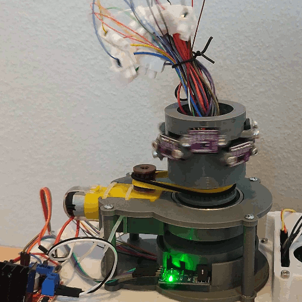
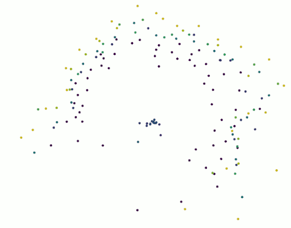
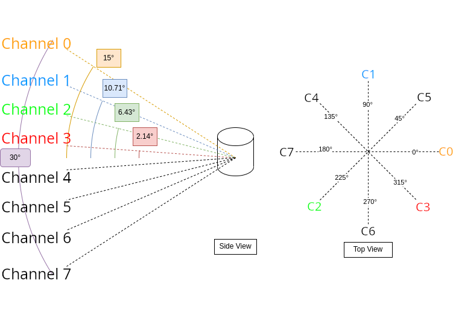
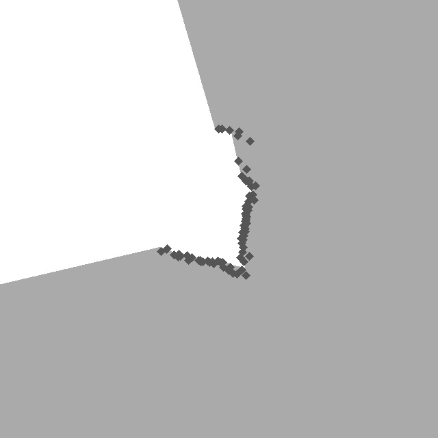

# Arduino 3D LiDAR

> [!IMPORTANT]
> Status: prototype. This repository documents a functional proof-of-concept with working firmware, printable parts, wiring references, sample data, and offline visualization tooling. Expect rough output, manual setup, and iteration rather than a polished product.

> [!NOTE]
> TL;DR: This project is a low-cost rotating 3D LiDAR built from 8 `VL53L0X` sensors, with firmware for Arduino/ESP32 and Python tools for offline visualization. It is useful for tinkering and rough room-scale mapping, but it is not a high-accuracy or high-fidelity LiDAR system.

If you are interested in longer-range sensors and not necessarily in 3D point cloud data, consider this alternative project: https://github.com/iliasam/OpenTOFLidar

## Overview
This repository contains the files needed to build a budget-friendly rotating 3D LiDAR sensor.
It combines 3D-printed parts, simple electronics, microcontroller firmware, sample recordings, and a lightweight Python viewer for inspecting captured point clouds.

Rotating LiDAR Sensor | LiDAR Data Visualization (5x Speed)
:---------------------:|:--------------------------:
 | 

## Repository Contents
| Category | Path | Description |
|----------|------|-------------|
| Firmware | `arduino-code/` | Arduino Uno firmware for the 8-sensor rotating scanner |
| Firmware | `esp32-code/` | ESP32 firmware variant for the same hardware concept |
| Python tools | `python-receiver-code/` | Offline visualization utilities for recorded `.npy` frames |
| 3D-print files | `stl-files/` | Printable mechanical parts plus assembly notes |
| Sample data | `data/sequences/01/lidar_points/` | Example recording for validating the Python viewer |
| Reference media | `Images/` | GIFs, wiring diagrams, and schematic images used in the docs |

## What This Project Is
- A low-cost 3D sensing prototype built from commodity time-of-flight sensors
- A hardware and firmware project that demonstrates multi-sensor scanning and reconstruction
- A practical tinkering platform for rough room-scale mapping and experimentation

## What This Project Is Not
- A drop-in replacement for a commercial LiDAR
- A precision point-cloud sensor for robotics or surveying workflows
- A polished product with enclosure, calibration workflow, and turnkey software

## How It Works
Eight `VL53L0X` range sensors are mounted on a rotating axis, each aimed at a different vertical angle toward a common origin. A rotation encoder at the base provides the azimuth angle. Combining range, vertical channel angle, and rotation angle makes it possible to reconstruct the scene in Cartesian coordinates.

|  |
| :-----------------------------------------: |
| *Schematic drawing of the mounting angles* |

The resulting point cloud is intentionally rough, but it is still useful for quick experiments such as room-scale occupancy mapping or basic spatial inspection.

|  |
| :---------------------------------------------------------------: |
| *Occupancy grid map generated from LiDAR sensor data (1x speed)* |

## Data Sample
The repository includes a sample recording in `data/sequences/01/lidar_points/` so you can inspect the expected output before building the hardware. Use `python-receiver-code/offline_visualization.py` to play back the bundled frames or your own recordings.

## Getting Started
1. Review the sample output.
   Check the GIFs above and the bundled `.npy` frames to understand the point-cloud quality you should expect.
2. Print the mechanical parts.
   Download the STL files from `stl-files/` and review `stl-files/assembly-instructions.md` for print orientation, wiring, and bring-up notes.
3. Choose a firmware target.
   Use `arduino-code/` for Arduino Uno or `esp32-code/` for ESP32. The wiring tables in the assembly guide match those firmware layouts.
4. Set up the Python viewer.
   The repository currently provides offline visualization for recorded `.npy` frames.

### Firmware Requirements
- Install the Arduino library `VL53L0X` by Pololu before compiling either firmware sketch.
- In Arduino IDE: `Sketch` -> `Include Library` -> `Manage Libraries...`, then search for `VL53L0X` and install the Pololu package.
- The ESP32 sketch in `esp32-code/` is updated for ESP32 Arduino core `3.x` timer APIs.

### Python Requirements
- Python `3.13+`
- `numpy`
- [VisPy](https://vispy.org/) for visualization
- [glfw](https://www.glfw.org/) as the lightweight windowing backend

### Install With `uv` (Recommended)

#### Windows:
```bash
powershell -ExecutionPolicy ByPass -c "irm https://astral.sh/uv/install.ps1 | iex"
uv python install 3.13
uv venv --python 3.13
.venv\Scripts\activate
uv sync
```

#### Linux/Mac:
```bash
curl -Ls https://astral.sh/uv/install.sh | sh
uv python install 3.13
uv venv --python 3.13
source .venv/bin/activate
uv sync
```

These commands use Python `3.13` as the default modern setup. If you already have another compatible interpreter installed, adjust the version accordingly.

### Install With `pip`
```bash
py -3.13 -m venv .venv
.venv\Scripts\activate
python -m pip install --upgrade pip
python -m pip install .
```

If you do not have Python `3.13` installed yet, replace `py -3.13` with any available compatible interpreter.

### Run the Offline Viewer
```bash
python python-receiver-code/offline_visualization.py
```

When no `--path` is provided, the script opens the bundled sample sequence from `data/sequences/01/lidar_points` and prints a disclaimer that the sample is intentionally rough.

The viewer uses a lightweight VisPy and GLFW window and loops until you close it, which makes it a quick install sanity check.

To visualize a different recording, pass either a single `.npy` frame or a directory of `.npy` frames:

```bash
python python-receiver-code/offline_visualization.py --path path\to\lidar_points
```

You can also adjust playback speed and marker size:

```bash
python python-receiver-code/offline_visualization.py --fps 4 --point-size 10
```

## Required Components
Below is a practical parts list for the 8-channel prototype. The Amazon links are non-affiliate example search links because exact listings change frequently.

| Part | Quantity | Notes | Amazon Link |
|------|----------|-------|-------------|
| `VL53L0X` breakout board | 8 | Use boards with accessible `XSHUT` pins for address reassignment | [Search](https://www.amazon.com/s?k=VL53L0X+breakout) |
| DC motor (3-12 V) | 1 | Use the ones with the yellow gear box | [Search](https://www.amazon.com/s?k=3-6+VDC+gear+motor) |
| Motor driver module | 1 | Any board compatible with your motor current and supply voltage (In doubt use L298N) | [Search](https://www.amazon.com/s?k=L298N+motor+driver) |
| Microcontroller | 1 | Arduino Uno or ESP32, depending on the firmware you plan to flash | [Search](https://www.amazon.com/s?k=Arduino+Uno+or+ESP32) |
| 12-wire slip ring | 1 | Carries power and signals through the rotating joint | [Search](https://www.amazon.com/s?k=12+wire+slip+ring) |
| Speed sensor / encoder module | 1 | Used to establish the rotation reference angle | [Search](https://www.amazon.com/s?k=LM393+speed+sensor+module) |
| Jumper wires | 1 set | Length depends on your mechanical layout | [Search](https://www.amazon.com/s?k=dupont+jumper+wires) |
| M3 screw assortment | 1 set | Verify lengths against your print tolerances and mounting choices | [Search](https://www.amazon.com/s?k=M3+screw+assortment) |
| Rubber band | 1 | Used in the current mechanical drive arrangement | [Search](https://www.amazon.com/s?k=rubber+bands) |
