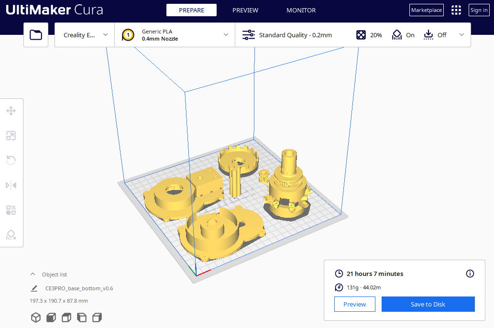
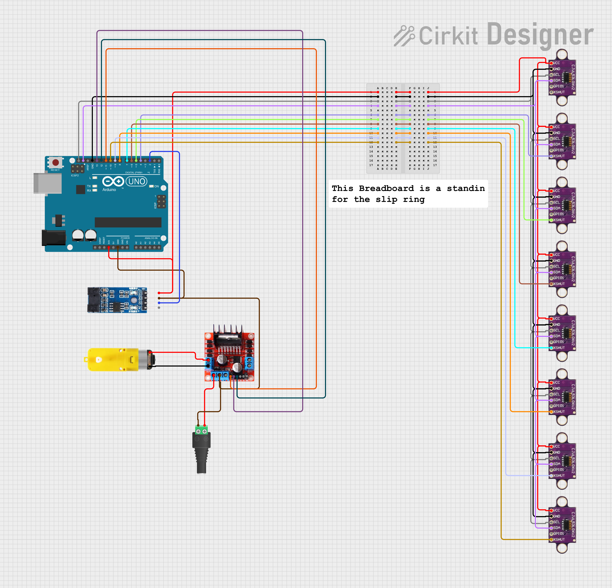
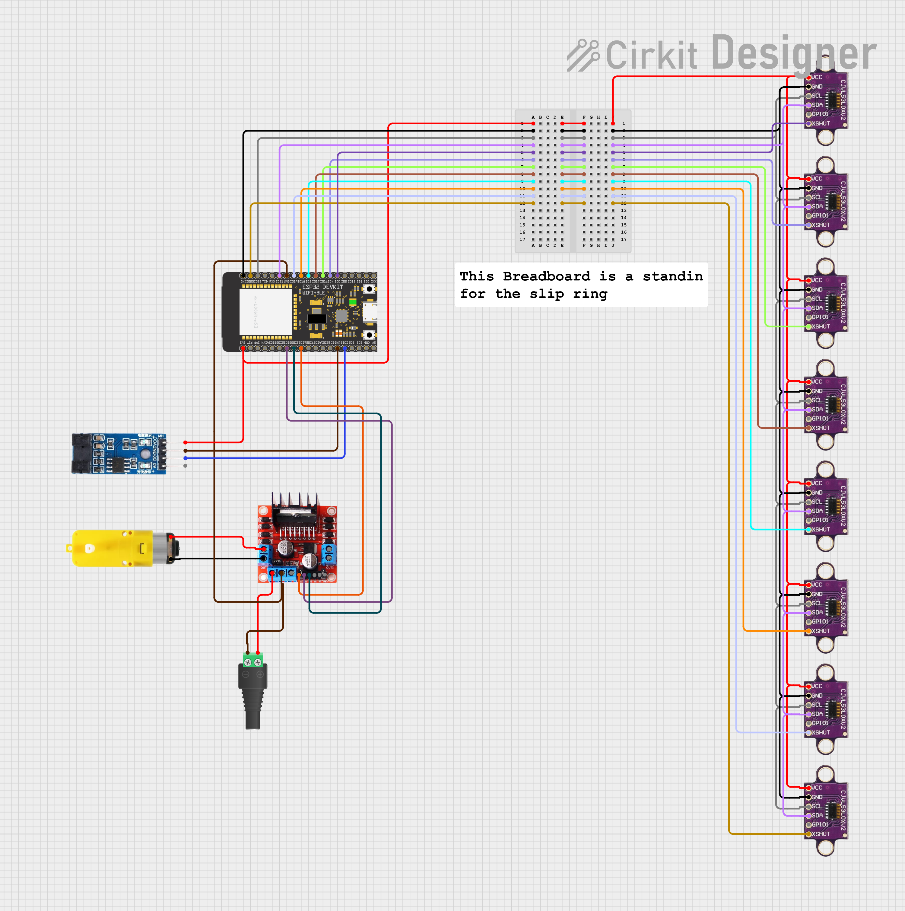

# Assembly Instructions

This document covers print orientation, wiring, and first bring-up notes for the prototype.

## 1. Print the Parts

- Print the STL files from `stl-files/`.
- Use the image above as the default print orientation reference.
- Layer height: 0.2mm or finer for better surface finish and dimensional accuracy.
- Infill: 20% or higher for structural integrity, especially for the rotating head and pillar.
- Supports: Enable supports for overhangs, particularly for the encoder mount and motor coupling features.
- Material: PLA is recommended for ease of printing and sufficient strength for prototyping. Consider PETG or ABS for improved durability and heat resistance if needed.

## 2. Mechanical Assembly

- Place slip ring on the shaft of the rotating head and secure it in the base top plate.
- Mount the motor top plate and secure it with zip ties. The gear box should fit snugly in the square cutout, and the motor shaft should align with the center hole.
- Mount the encoder disc on the shaft of the rotating head.
- Route the slip ring wires through the pillar and into the bottom base through the flat hole to the side of the base for connection to the `Arduino` or `ESP32`.
- Now add the pillars to the top and bottom base plates and secure them with screws.
- Add the small gear to the motor shaft.
- Connect the gear of the motor shaft and the rotating head with a rubber band or O-ring. Adjust the tension as needed for smooth rotation without slipping.
- Add the `VL53L0X` sensors to the sensor mounts on the rotating head, ensuring that the sensor faces are oriented correctly for distance measurement.
- Follow the wiring diagrams in sections 3 and 4 to connect the sensors, motor driver, and encoder to the `Arduino Uno` or `ESP32`.
- Secure the sensors with screws or adhesive as needed, ensuring that the sensor faces are flush with the outer surface of the rotating head for accurate measurements.

## 3. Arduino Uno Wiring

This wiring layout matches `arduino-code/write_byte_output_batchwise.ino`

> [!CAUTION]
> `VL53L0X` `XSHUT` is not 5 V tolerant. Driving it directly from 5 V can damage the sensor.

Function | Arduino pin | Notes
---------|-------------|------
`VL53L0X` Sensor 0 `XSHUT` | not used in code | Sensor 0 stays on the default I2C address `41`
`VL53L0X` Sensor 1 `XSHUT` | 4 | Reassigned to I2C address `42`
`VL53L0X` Sensor 2 `XSHUT` | 5 | Reassigned to I2C address `43`
`VL53L0X` Sensor 3 `XSHUT` | 6 | Reassigned to I2C address `44`
`VL53L0X` Sensor 4 `XSHUT` | 7 | Reassigned to I2C address `45`
`VL53L0X` Sensor 5 `XSHUT` | 8 | Reassigned to I2C address `46`
`VL53L0X` Sensor 6 `XSHUT` | 9 | Reassigned to I2C address `47`
`VL53L0X` Sensor 7 `XSHUT` | 10 | Reassigned to I2C address `48`
Motor driver enable `enA` | 11 | PWM speed control
Motor driver input `in1` | 12 | Direction control
Motor driver input `in2` | 13 | Direction control
Rotation encoder output | 2 | Interrupt input on rising edge
USB serial | `Serial` at `115200` | Data output to host computer

## 4. ESP32 Wiring

This wiring layout matches `esp32-code/write_byte_output_batchwise_esp32.ino`

> [!CAUTION]
> `VL53L0X` `XSHUT` is not 5 V tolerant. Confirm that your wiring and sensor boards stay within the correct logic voltage range.

Function | ESP32 pin | Notes
---------|-----------|------
`VL53L0X` Sensor 0 `XSHUT` | 0 | Reassigned to I2C address `42`
`VL53L0X` Sensor 1 `XSHUT` | 4 | Reassigned to I2C address `43`
`VL53L0X` Sensor 2 `XSHUT` | 16 | Reassigned to I2C address `44`
`VL53L0X` Sensor 3 `XSHUT` | 17 | Reassigned to I2C address `45`
`VL53L0X` Sensor 4 `XSHUT` | 5 | Reassigned to I2C address `46`
`VL53L0X` Sensor 5 `XSHUT` | 18 | Reassigned to I2C address `47`
`VL53L0X` Sensor 6 `XSHUT` | 19 | Reassigned to I2C address `48`
`VL53L0X` Sensor 7 `XSHUT` | 23 | Sensor 7 stays on the default I2C address `41`
Motor driver enable `enA` | 25 | PWM speed control
Motor driver input `in1` | 33 | Direction control
Motor driver input `in2` | 32 | Direction control
Rotation encoder output | 13 | Interrupt input on rising edge
USB serial | `Serial` at `115200` | Data output to host computer

## 5. Pre-Power Checklist

- Verify that every `VL53L0X` `XSHUT` line is wired to the intended pin.
- Verify that no `XSHUT` pin is exposed to 5 V.
- Verify motor driver polarity before running the rotating assembly.
- Verify the encoder output pin before relying on angle synchronization.
- Confirm that the flashed firmware matches the wiring table you used.
- Make sure that the motor and the board is powered via their respective power inputs, and not just through USB. This is especially important for the `ESP32` which may draw more current than the USB port can provide when the motor is running. 

## 6. Bring-Up Notes

- If the point cloud data is not appearing on the host computer, check the serial output for error messages or invalid readings.
- If the motor is not spinning, check the motor driver connections and ensure that the enable pin is receiving the correct PWM signal.
- If the encoder readings are erratic, check the wiring and ensure that the encoder disc is properly mounted and aligned with the sensor.
- If the resulting point cloud is mis-aligned or distorted, verify that the motor spin direction matches the expected direction in the code, else the angle calculations will be inverted. Switch the motor driver input pins if needed to correct the direction.
